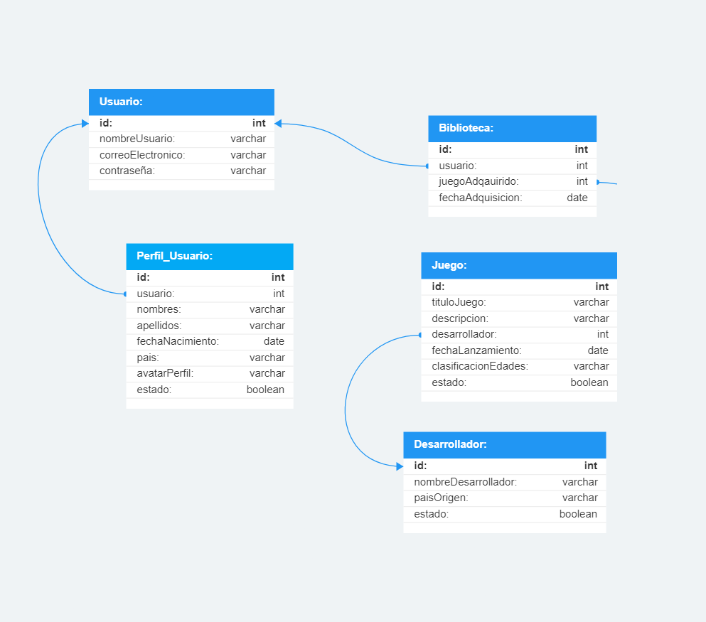

## 🕹️ Sistema de Administración de Compras de Juegos en Línea (Desarrollado con MERN)

**Este sistema de administración está diseñado para ayudarte a gestionar eficazmente la información de compra de juegos en una tienda virtual de juegos en línea. Fue desarrollado utilizando el stack MERN, que incluye MongoDB, Express.js, React y Node.js. Con esta aplicación, puedes gestionar proveedores, productos, empleados, sucursales y clientes de manera conveniente y eficiente.**

 

# 💡 Objetivo

**Se centra en la creación de una herramienta que mejore la eficiencia y la organización en una tienda virtual de juegos en línea, facilitando la gestión de múltiples aspectos importantes de la operación empresarial.**

 

# 📋 Funcionalidades Principales

- **Gestión de Biblioteca: Administra y organiza la colección de juegos de un usuario, permitiéndole agregar, eliminar y consultar los títulos que posee en su biblioteca de juegos.**

- **Gestión de Usuario: Maneja las operaciones de registro, inicio de sesión y gestión de datos de usuario, como nombre, correo electrónico y contraseña, proporcionando autenticación y autorización en la plataforma de juegos.**

- **Gestión de Perfil_Usuario:  Permite a los usuarios personalizar sus perfiles con información adicional, como nombre completo, fecha de nacimiento, país y avatar de perfil, mejorando la experiencia de juego social.**

- **Gestión de Juego:  Facilita la administración de juegos disponibles en la plataforma, incluyendo la adición de nuevos títulos, eliminación de juegos obsoletos y detalles como título, descripción y fecha de lanzamiento.**

- **Gestión de Desarrollador: Administra la información de los desarrolladores de juegos, como nombre de la empresa y país de origen, para mostrar créditos y detalles de contacto en la plataforma de juegos.**

 

# 🖇️ Diagrama Entidad Relación

## Diagrama Entidad relacion en SQL

 

# 🎨 Diseño UIX

# Tecnologías Utilizadas

  
  
  
  
  
  
  

 

# 🖋️Autor

**Anthoni Hernandez**
